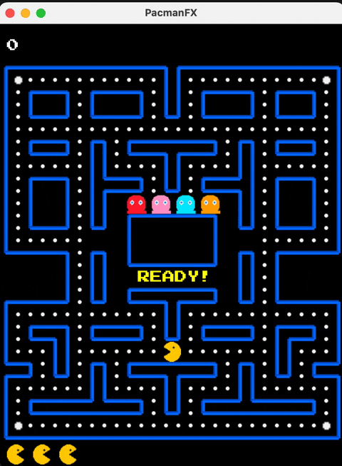

# PacmanFX

A Pac-Man-inspired arcade game built with JavaFX, with a codebase structured to showcase classic OO design patterns.




## What it is

- Playable JavaFX Pacman clone (keyboard-controlled)
- Data-driven gameplay via `src/main/resources/config.json` and map files under `src/main/resources/`
- A compact reference implementation of Strategy/State/Decorator patterns in a real gameplay loop

## Who it's for

- Want to play quickly: follow the “Quick start” section
- Want to learn: jump to “Architecture & patterns”
- Want to extend it: tweak `config.json`, swap maps, or add new ghost behaviors

## Demo

If your Markdown viewer does not render GIFs, use the PNG strip above or see `docs/assets/screenshot-1.png`.

## Quick start

### Prerequisites

- JDK 17+

### Run

```bash
./gradlew run
```

### Build

```bash
./gradlew build
```

### Create a distributable

```bash
./gradlew installDist
```

### Use a custom config

```bash
./gradlew run --args="--config=/path/to/config.json"
```

## Controls

- Arrow keys: move

## Architecture & patterns

This project is intentionally organized around a few core patterns to keep game logic extensible:

### Strategy (ghost AI)

- Strategy: `pacman.model.strategy.GhostChaseStrategy`
- Implementations: `BlinkyChaseStrategy`, `PinkyChaseStrategy`, `InkyChaseStrategy`, `ClydeChaseStrategy`
- Context: `pacman.model.entity.dynamic.ghost.GhostImpl`

### State (ghost modes)

- State: `pacman.model.state.GhostState`
- Implementations: `NormalState`, `FrightenedState`
- Context: `pacman.model.entity.dynamic.ghost.GhostImpl`

### Decorator (dynamic behavior)

- Component: `pacman.model.decorator.Component`
- Base implementation: `pacman.model.entity.dynamic.ghost.GhostImpl`
- Decorators: `pacman.model.decorator.GhostDecorator`, `FrightenedGhostDecorator`

## License

MIT (see `LICENSE`).

## Third-party notices

See `THIRD_PARTY_NOTICES.md`.

## Trademark

See `TRADEMARKS.md`.

## Contributing

See `CONTRIBUTING.md`.
